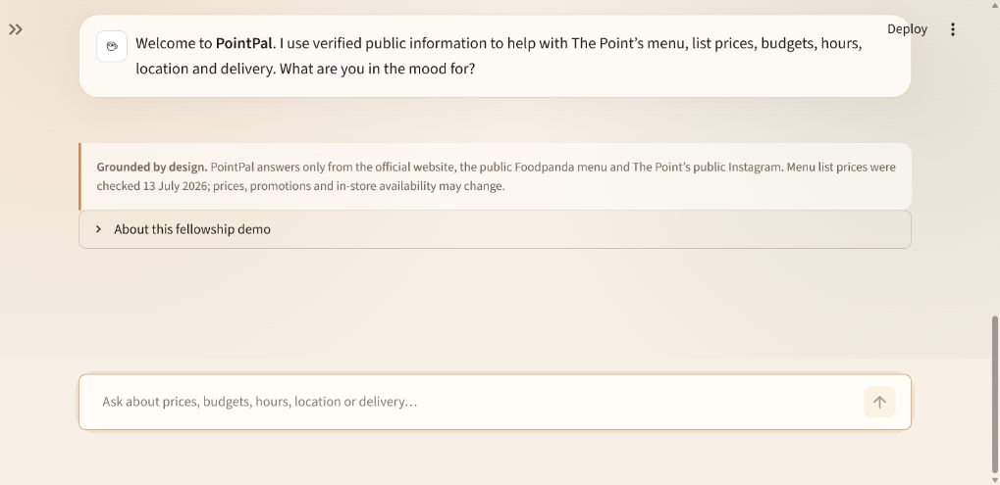

# PointPal — The Point’s smart FAQ and menu concierge

PointPal is a polished, no-paid-API conversational assistant built for the **The Point × QD Fellowship — Innovation & AI Track**. It helps customers find verified café information, search the real menu, check list prices, and get recommendations by category and budget in English or basic Roman Urdu.

> **Live demo:** Pending final Streamlit Community Cloud deployment.



## Features

- Answers verified opening-hours, location, contact, Instagram, and delivery questions
- Searches **75 distinct Foodpanda menu items** and their list prices
- Handles exact item-price queries such as “What is the price of Iced Spanish?”
- Combines category and budget constraints with AND filtering
- Recommends coffee, cold drinks, desserts, food, tea, matcha, and more
- Understands common English and Roman Urdu wording such as `sasti`, `tak`, `se kam`, `kahan`, and `kab`
- Declines unsupported questions instead of inventing business information
- Shows a clickable source and price-change caveat with menu answers
- Requires no API key, paid model, database, or paid hosting
- Includes desktop and mobile-responsive styling

## How it works

PointPal uses a small, curated knowledge base and deterministic intent matching rather than a paid generative-AI API. The retrieval layer:

1. Normalizes English and Roman Urdu phrasing.
2. Detects verified café FAQ intents.
3. Extracts budgets from forms such as `under Rs. 800`, `800 tak`, and `800 se kam`.
4. Resolves exact menu items before broad categories.
5. Applies every requested tag and the budget together.
6. Ranks matching items using only Foodpanda’s public popularity signals and list prices.
7. Falls back safely when the public sources do not verify an answer.

This keeps the experience fast, transparent, testable, and free to run.

## Technology

- **Python** — retrieval, intent handling, and menu filtering
- **Streamlit** — responsive chat interface and free Community Cloud hosting
- **Standard library only** for the retrieval engine (`dataclasses`, `re`, `difflib`, `unittest`)
- **Streamlit AppTest** — interface and chat-flow smoke tests
- **GitHub** — source control and deployment source

## Run locally

Requirements: Python 3.10 or newer.

```bash
git clone https://github.com/SaifSajjad/pointpal-thepoint.git
cd pointpal-thepoint
python -m venv .venv
```

Activate the environment:

```bash
# Windows
.venv\Scripts\activate

# macOS/Linux
source .venv/bin/activate
```

Install and run:

```bash
python -m pip install -r requirements.txt
python -m streamlit run app.py
```

Open `http://localhost:8501` if it does not open automatically.

## Tests

The suite covers the eight required fellowship demo questions, exact item lookup, category/budget intersections, Roman Urdu variants, unsupported-question safety, source/caveat rendering, menu integrity, and Streamlit chat flows.

```bash
python -m unittest discover -s tests -v
```

## Verified data sources

- [The Point official website](https://www.thepoint.cafe/) — hours, address, and phone number
- [The Point on Foodpanda](https://www.foodpanda.pk/restaurant/vb7p/the-point-vb7p) — menu, list prices, popularity badges, delivery, and pick-up
- [@thepointlhr on Instagram](https://www.instagram.com/thepointlhr/) — official public social profile

The menu snapshot was checked on **13 July 2026**. PointPal uses undiscounted Foodpanda list prices because temporary promotions change. Prices, promotions, availability, and in-store prices may change.

The official site currently contains conflicting hours: its global footer says **8:00 AM–1:00 AM**, while the Phase 6 outlet listing says **9:00 AM–12:00 AM (Mon–Sun)**. PointPal discloses both and recommends calling or checking Instagram before visiting.

## Project structure

```text
pointpal-thepoint/
├── .streamlit/config.toml   # Theme and deployment-safe settings
├── app.py                   # Streamlit UI
├── pointpal.py              # Pure retrieval and menu logic
├── requirements.txt         # Runtime dependency
├── tests/
│   ├── test_app.py          # Streamlit UI smoke tests
│   └── test_pointpal.py     # Retrieval regression tests
├── docs/pointpal-preview.png
├── SUBMISSION.md            # Form copy, demo script, and checklist
└── README.md
```

## Screenshot

The image above is captured from the tested local Streamlit build at a 1280 × 720 browser viewport. The app was also checked at a 390 × 844 mobile viewport with no horizontal overflow.

## Future improvements

- Move the curated menu into a live owner-managed Google Sheet or CMS
- Add dietary and allergen fields once The Point provides verified data
- Add multilingual Urdu-script support
- Connect the same retrieval layer to Instagram DMs or WhatsApp
- Add live stock/availability and location-aware delivery estimates
- Track anonymous question categories to improve FAQ coverage without storing chat content

## Responsible-answering notes

PointPal does not claim unverified facilities, dietary options, ingredients, or availability. Questions outside the public knowledge base receive a transparent fallback and can be confirmed with The Point directly.
